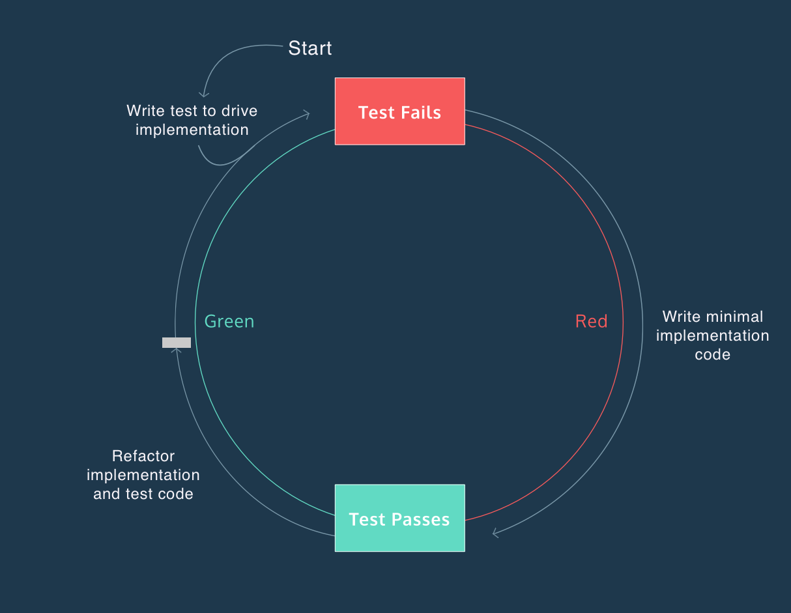

<!-- _class: lead -->
# Microservices with Quarkus
## Day 2: Data Access & Security

---

# Morning Session 1 (09:00 - 10:00)
## Topic: Implementing Persistence
### Activity: Hands-on Lab 3

---

# Lab 3 Objectives

- Persist `TrainStop` data in a relational database.
- Implement a full CRUD REST API for `TrainStop` entities.
- Use a Test-Driven Development (TDD) approach for implementation.
- Leverage Quarkus Dev Services for a zero-config development database.

---

# Morning Session 2 (10:45 - 11:45)
## Topic: Relational Databases with Panache

---

# Debrief: Lab 3 (Panache Entity)

- **Goal**: Simplify persistence with Hibernate ORM.
- **Key Features**:
  - No more `EntityManager` boilerplate.
  - Simplified queries: `Person.find("name", "Scott")`
  - Automatic generation of CRUD operations.
- **Guides**:
  - [Hibernate ORM with Panache](https://quarkus.io/guides/hibernate-orm-panache)

---

# Debrief: Lab 3 (Dev Services)

- **Dev Services for PostgreSQL**: Quarkus automatically started a PostgreSQL container for us!
- [Dev Services for Datasources](https://quarkus.io/guides/datasource#dev-services-for-datasources)
- **Reactive Datasources**: `quarkus-reactive-oracle-client`
- **JDBC Data Sources**: `quarkus-jdbc-postgresql`

---

# Debrief: Lab 3 (`@Transactional`)

- Manages the lifecycle of a database transaction.
  - **Start**: A transaction is automatically started when a method annotated with `@Transactional` is entered.
  - **Commit**: If the method completes successfully, the transaction is committed.
  - **Rollback**: If the method throws a runtime exception, the transaction is rolled back.
- **Why it's required**: All write operations in Panache (like `persist()`, `update()`, `delete()`) must be performed within a transaction.
- **Where to put it**: Typically on JAX-RS resource methods that modify data, or on methods in a service layer.
- **Guide**: [Transactions in Quarkus](https://quarkus.io/guides/transaction)

---

<!-- _class: fit-table -->
# Debrief: Lab 3 (Active Record vs. Repository)

| Feature          | Active Record (`PanacheEntity`)                               | Repository (`PanacheRepository`)                                |
| ---------------- | ------------------------------------------------------------- | --------------------------------------------------------------- |
| **Concept**      | Persistence logic is mixed with the business object.          | Persistence logic is separated into a dedicated repository class. |
| **Usage**        | `person.persist()`, `Person.findById(id)`                     | `personRepository.persist(person)`, `personRepository.findById(id)` |
| **Pros**         | Simple, concise, great for small to medium applications.      | Better separation of concerns, easier to test and mock.         |
| **Cons**         | Can violate Single Responsibility Principle, harder to mock.  | More boilerplate code (entity + repository).                    |
| **When to use?** | When your data model is simple and closely maps to the DB.    | For complex applications or when you need to abstract the data layer. |

---

# The Repository Pattern (Entity)

Separates the persistence logic from the entity.

**1. The Entity (No Panache base class)**
```java
@Entity
public class Person {
    @Id @GeneratedValue
    public Long id;
    public String name;
    public LocalDate birth;

    // Getters and Setters
}
```

---

## The Repository Pattern (Repository)

**2. The Repository**
```java
@ApplicationScoped
public class PersonRepository implements PanacheRepository<Person> {

   // custom queries can be added here
   public Person findByName(String name){
     return find("name", name).firstResult();
   }
}
```

---

## The Repository Pattern (Resource)

**3. The Resource**
```java
@Inject
PersonRepository personRepository;

@GET
@Path("/{id}")
public Person getById(Long id) {
    return personRepository.findById(id);
}

@GET
@Path("/search/{name}")
public Person search(String name) {
    return Person.findByName(name);
}
```

---

# Paging and Sorting

```java
// Create a PanacheQuery object
PanacheQuery<Person> query = Person.find("status", Status.Alive);

// 1. Set the page size and index
query.page(Page.of(0, 10)); // 1st page, 10 results

// 2. Get the results for the current page
List<Person> firstPage = query.list();

// 3. Get the total number of pages
int pageCount = query.pageCount();

// 4. Get the total number of records
long recordCount = query.count();
```

- Sorting is just as easy: `Person.find("status", Status.Alive).list()`
- **Guide**: [Paging and Sorting](https://quarkus.io/guides/hibernate-orm-panache#paging)

---

# TDD with Quarkus Dev Mode (1)

Quarkus's dev mode (`./mvnw quarkus:dev`) provides an exceptional environment for Test-Driven Development.

- **Continuous Testing**: As soon as you save a file, Quarkus recompiles your code and re-runs the relevant tests.
- **Instant Feedback**: You get immediate feedback in your terminal, telling you whether your changes fixed a test or broke another one.
- **Guide**: [Continuous Testing](https://quarkus.io/guides/continuous-testing)

---

# TDD with Quarkus Dev Mode (2)

[source](https://content.codecademy.com/programs/tdd-js/articles/red-green-refactor-tdd.png)

---

# Morning Session 3 (12:00 - 12:30)
## Topic: Exposing and Documenting REST Endpoints

---

# Jakarta RESTful Web Services
- The standard for creating RESTful web services in Java.
- **Core Annotations**:
  - `@Path`: Defines the base URI for the resource.
  - `@GET`, `@POST`, `@PUT`, `@DELETE`: Map to HTTP methods.
  - `@Produces`: Sets the response media type (e.g., `application/json`).
  - `@Consumes`: Sets the request media type.
  - `@PathParam`: Injects URI path parameters.
- **Returning a `Response`**: For more control, return a `Response` object. This allows you to set headers, status codes, and the response body.

---

# Jakarta RESTful Web Services

```java
@POST
@Transactional
public Response create(TrainStop stop) {
    stop.persist();
    // Return 201 Created with a link to the new resource
    return Response.created(URI.create("/stops/" + stop.id)).build();
}
```
- **Guide**: [Quarkus REST](https://quarkus.io/guides/rest)

---

# API Documentation with OpenAPI
- **Standard**: OpenAPI is the industry standard for defining REST APIs.
- **Automatic Generation**: Quarkus automatically generates an `openapi.yaml` file for your JAX-RS endpoints.
- **Swagger UI**: A user-friendly interface to explore and test your API.
  - Accessible at `/q/swagger-ui` in dev mode.
- **Guide**: [OpenAPI and Swagger UI](https://quarkus.io/guides/openapi-swaggerui)

---

<!-- _class: lead -->
# Lunch Break (12:30 - 13:15)

---

# Afternoon Session 1 (13:15 - 14:15)
## Topic: Documenting Persisted Data
### Activity: Hands-on Lab 4

---

# Lab 4 Objectives

- Automatically generate API documentation from JAX-RS endpoints.
- Enrich the generated documentation with descriptive annotations.
- Implement an idempotent `create` endpoint for `TrainStopResource`.
- Explore and test the API using the integrated Swagger UI.

---

# Afternoon Session 2 (14:30 - 15:00)
## Topic: REST Clients & Security Concepts

---

# MicroProfile REST Client

- **Goal**: Create a type-safe client to consume other RESTful services.
- **How it works**:
  1. Define a Java interface with JAX-RS annotations.
  2. Annotate it with `@RegisterRestClient`.
  3. Inject it with `@RestClient`.
- **Configuration**: Set the base URL in `application.properties`.
- **Guide**: [REST Client Reactive](https://quarkus.io/guides/rest-client-reactive)

---

# Introduction to Security

- **Core Concepts**:
  - **OAuth2**: An authorization framework for granting access to resources.
  - **OpenID Connect (OIDC)**: An identity layer built on top of OAuth2. It provides authentication and user information.
  - **JWT (JSON Web Token)**: A compact, URL-safe means of representing claims to be transferred between two parties.
- **Identity Provider**: A trusted provider that manages user identity and authentication (e.g., Keycloak, Auth0, Okta).
- **Guides**:
  - [OpenID Connect (OIDC) Bearer Token Authentication](https://quarkus.io/guides/security-oidc-bearer-token-authentication)
  - [Using JWT RBAC](https://quarkus.io/guides/security-jwt)

---

# Afternoon Session 3 (15:00 - 16:00)
## Topic: Securing and Consuming a Protected API
### Activity: Hands-on Lab 5

---

# Lab 5 Objectives

- Secure a REST endpoint using role-based access control (RBAC).
- Configure the microservice to authenticate with a Keycloak server.
- Consume a protected, external API using a type-safe REST client.
- Enrich service data with information from an external service.

---

# End of Day 2

- Recap & Q&A
- Preview of Day 3: Reactive Messaging & Monitoring