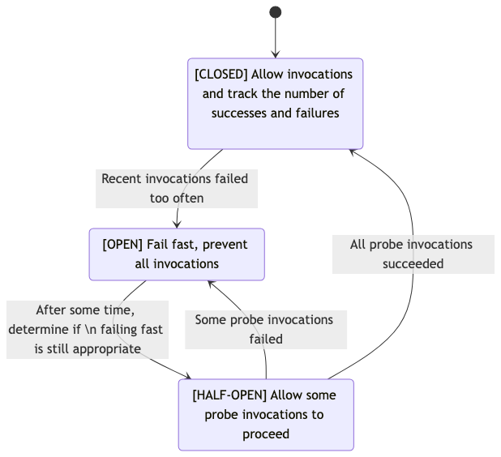
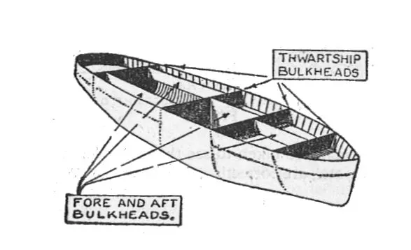
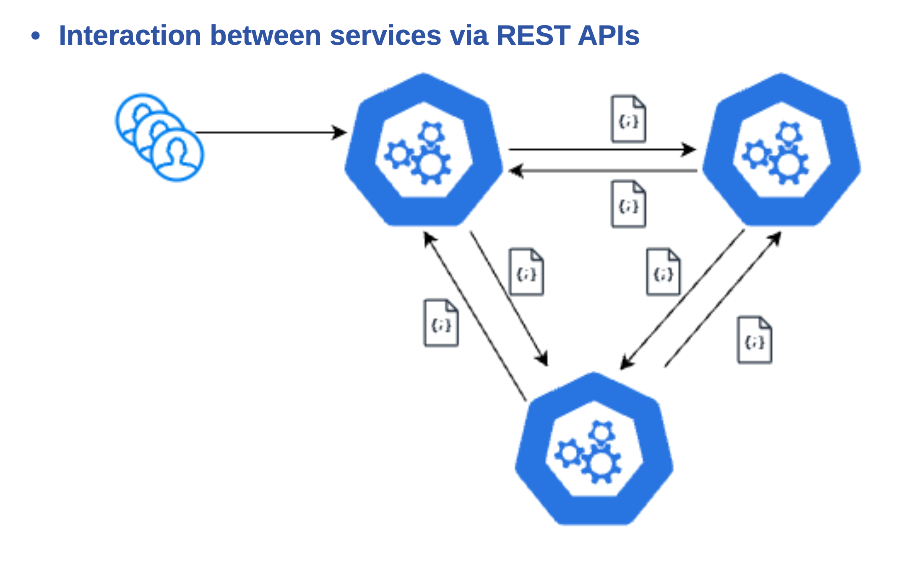
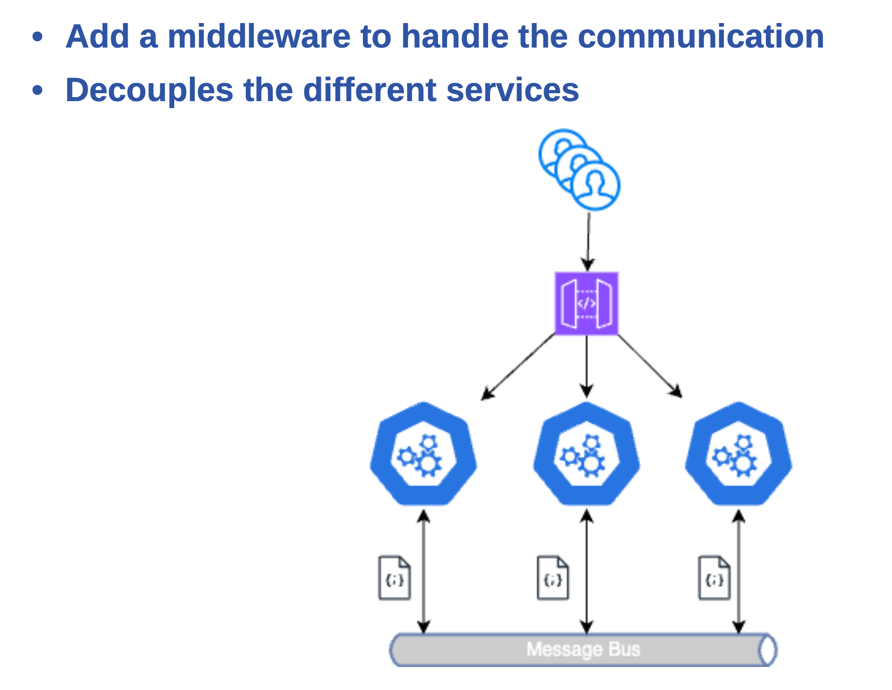
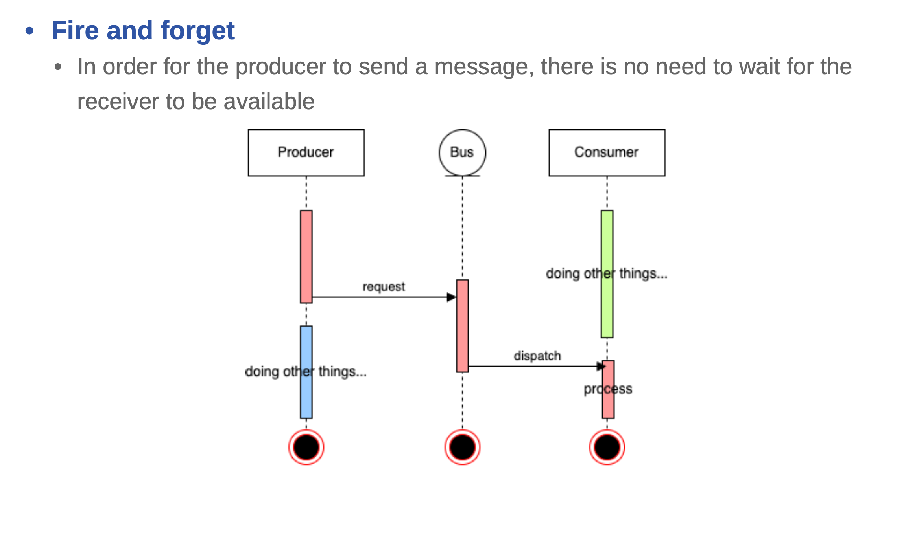
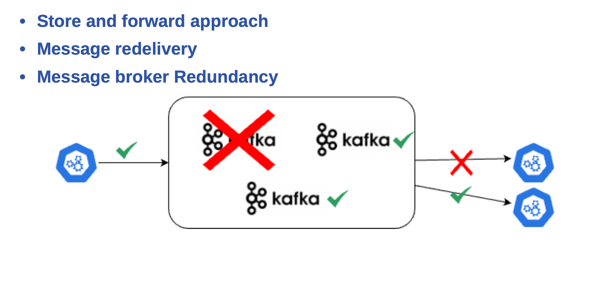
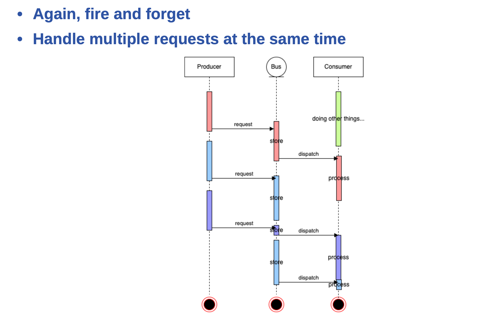
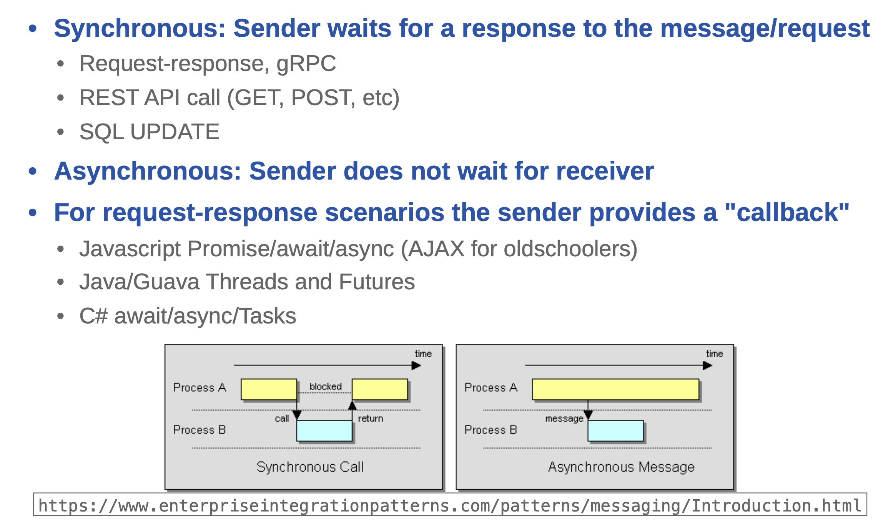

<!-- _class: lead -->
# Microservices with Quarkus
## Day 3: Building Resilient & Asynchronous Microservices

---

# Morning Session 1 (09:00 - 10:30)
## Topic: Building Resilient Microservices
### Activity: Hands-on Lab 6

---

# Lab 6 Objectives

- Apply resilience patterns to the `train-line-service`.
- Handle latency and transient failures from the `station-service`.
- Use `@Timeout` and `@Retry` to meet a 90% success rate objective.
- Implement a `@CircuitBreaker` to prevent cascading failures.
- Use a `@Fallback` to provide a clean response when failures occur.

---

# What is Resilience?

In a distributed system, failures are inevitable.
- Network issues
- Service unavailability
- High latency

**Resilience** is the ability of a system to gracefully handle these failures and remain functional.

---

# MicroProfile Fault Tolerance

Provides a standard set of annotations to build resilient microservices.
- **Goal**: Isolate and manage failures, preventing them from cascading.
- **Key Annotations**:
  - `@Timeout`: Sets a duration limit for a method execution.
  - `@Retry`: Automatically retries a failed execution.
  - `@CircuitBreaker`: Stops repeated calls to a failing service.
  - `@Fallback`: Provides an alternative result for a failed execution.
  - `@Bulkhead`: Limits concurrent requests to a method.
  - `@RateLimit`: Limit the number of requests over time.
- **Guide**: [Fault Tolerance with SmallRye](https://quarkus.io/guides/smallrye-fault-tolerance)

---

# SmallRye Fault Tolerance

- **Implementation**: Quarkus uses SmallRye to implement the MicroProfile Fault Tolerance specification.
- **Beyond the Spec**: SmallRye provides additional features and fine-grained configuration.
- **Asynchronous Support**: All fault tolerance annotations work with both synchronous and asynchronous (`CompletionStage`, `Uni`) methods.
- **Configuration**: While annotations are easy, all parameters can be configured and overridden in `application.properties` for greater flexibility.

---

# `@Timeout`

- **Problem**: A synchronous call is taking too long, tying up resources.
- **Solution**: Abort the operation if it exceeds a specified duration.

```java
@GET
@Path("/{id}")
@Timeout(250) // Fails if execution takes longer than 250ms
public Product getProduct(@PathParam("id") String id) {
    // ... logic that might be slow
}
```
- Throws a `TimeoutException` on timeout.

---

# `@Retry`

- **Problem**: An operation fails due to a transient issue (e.g., temporary network glitch).
- **Solution**: Automatically retry the operation a few times.

```java
@GET
@Path("/{id}")
@Retry(maxRetries = 3, delay = 200) // Retry up to 3 times, with 200ms delay
public Station getStationById(@PathParam("id") String id) {
    // ... call to a potentially flaky service
}
```
- Highly configurable (`maxDuration`, `jitter`, `retryOn`, `abortOn`).

---

# `@CircuitBreaker`

- **Problem**: A downstream service is down. Repeatedly retrying is wasteful and can make recovery harder (thundering herd).
- **Solution**: "Open" a circuit to fail-fast, and periodically check if the service has recovered.

**States**:
1.  **CLOSED**: Operations are executed. If failures exceed a threshold, moves to OPEN.
2.  **OPEN**: Operations fail immediately (`CircuitBreakerOpenException`). After a delay, moves to HALF-OPEN.
3.  **HALF-OPEN**: A trial request is allowed. If it succeeds, moves to CLOSED. If it fails, moves back to OPEN.

---

### `@CircuitBreaker` State Machine



---

# `@CircuitBreaker` Example

```java
@GET
@Path("/{id}")
@CircuitBreaker(
    requestVolumeThreshold = 10, // in the last 10 requests...
    failureRatio = 0.6,          // ...if 60% fail...
    delay = 5000,                // ...open the circuit for 5s
    successThreshold = 2         // need 2 successes to close
)
public Station getStationById(@PathParam("id") String id) {
    // ... call to a service that might be down
}
```
[CircuitBreaker SmallRye Documentation](https://smallrye.io/docs/smallrye-fault-tolerance/6.2.1/reference/circuit-breaker.html)

---

# `@Fallback`

- **Problem**: An operation has failed (after timeouts and retries), but we want to provide a graceful response instead of an exception.
- **Solution**: Specify a method to call to get an alternative result.

```java
@GET
@Path("/{id}")
@Retry(maxRetries = 2)
@Fallback(fallbackMethod = "getUnknownStation")
public Station getStationById(@PathParam("id") String id) {
    // ... call to a failing service
}
```

---

# `@Fallback`
- The fallback method must have a compatible signature.
```java
public Station getUnknownStation(String id) {
    // Return a default or cached value
    return new Station(id, "Unknown Station");
}
```

---

# `@Fallback` Configuration

You can control precisely when the fallback is triggered.

- **`applyOn`**: Specifies an array of exceptions that should trigger the fallback. If empty, all exceptions trigger it.
- **`skipOn`**: Specifies an array of exceptions that should *not* trigger the fallback.

---

# `@Fallback` Configuration

```java
@POST
@Fallback(
    fallbackMethod = "handleCreationFailure",
    applyOn = {WebApplicationException.class}, // Only apply on web exceptions
    skipOn = {IllegalArgumentException.class} // But not for bad arguments
)
public Response create(TrainStop stop) {
    // ... logic that might fail
}
```

This gives you fine-grained control over your error handling strategy.

[SmallRye Fallback Documentation](https://smallrye.io/docs/smallrye-fault-tolerance/6.2.1/reference/fallback.html)

---

# `@Bulkhead`

- **Problem**: A single slow dependency can exhaust all available resources, causing the entire application to become unresponsive.
- **Analogy**: The bulkhead pattern is named after the partitioned sections of a ship's hull. If one compartment floods, the bulkheads prevent the entire ship from sinking.
- **Solution**: Isolate failures in one part of the system from affecting others by limiting the number of concurrent requests to a specific service.


---

# `@Bulkhead` in Quarkus

- **Semaphore-based**: Limits the number of concurrent requests to a method.
- If the limit is reached, subsequent calls will fail immediately with a `BulkheadException`.

```java
@GET
@Path("/{id}")
@Bulkhead(5) // Only 5 concurrent requests allowed
public Station getStationById(@PathParam("id") String id) {
    // ... call to a service that can be slow
}
```

- **Thread-pool-based (for async)**: Provides a dedicated thread pool for the annotated method, isolating its execution from other threads.

[SmallRye Bulkhead Documentation](https://smallrye.io/docs/smallrye-fault-tolerance/6.2.1/reference/bulkhead.html)

---

# `@RateLimit`

- **Problem**: A client is calling an endpoint too frequently, potentially overloading the service or a downstream resource (like a message queue).
- **Solution**: Restrict the number of requests allowed within a specific time window.
- **Implementation**: This is a SmallRye-specific annotation, **not** part of the MicroProfile Fault Tolerance specification.

[RateLimit SmallRye Documentation](https://smallrye.io/docs/smallrye-fault-tolerance/6.2.1/reference/rate-limit.html)

---

# `@RateLimit` in Quarkus

```java
import io.smallrye.faulttolerance.api.RateLimit;
import java.time.temporal.ChronoUnit;

@POST
@Path("/notify")
@RateLimit(
    value = 10,
    window = 1,
    windowUnit = ChronoUnit.MINUTES
) // Allow only 10 requests per minute
public Response notify(String message) {
    // Publish message to a queue
    messageProducer.send(message);
    return Response.accepted().build();
}
```
- If the rate limit is exceeded, a `RateLimitException` is thrown.

---

# Priority of Fault Tolerance Strategies

```scala
Fallback(
    Retry(
        CircuitBreaker(
            RateLimit(
                Timeout(
                    Bulkhead(
                        ... the guarded method ...
                    )
                )
            )
        )
    )
)
```
[Interations with Other Strategies](https://smallrye.io/docs/smallrye-fault-tolerance/6.2.1/howto/multiple.html)

---

<!-- _class: lead -->
# Lunch Break (12:00 - 13:00)

---

# Afternoon Session 1 (13:00 - 14:30)
## Topic: Asynchronous Messaging

---

# Why Asynchronous Messaging?

- **Decoupling**: Services don't need to know about each other directly. They just produce/consume messages.
- **Resilience**: The system can tolerate temporary unavailability of a consumer. Messages will be processed when it comes back online.
- **Scalability**: You can have multiple instances of a consumer processing messages from a queue in parallel.
- **Responsiveness**: Fire-and-forget. The client doesn't have to wait for the full processing to complete.

---



---

]

---

]

---

]

---

]

---

# Synchronous vs. Asynchronous

]

---

# MicroProfile Reactive Messaging

A standard for building event-driven, asynchronous applications.
- **Core Concepts**:
  - **Channel**: A virtual, named destination. Can be in-memory or mapped to a message broker (like Kafka or AMQP).
  - **`@Outgoing`**: A method that produces messages and sends them to a channel.
  - **`@Incoming`**: A method that consumes messages from a channel.
  - **Connector**: The "glue" that maps a channel to a specific messaging technology.

- **Guide**: [Reactive Messaging](https://quarkus.io/guides/reactive-messaging)

---

# Producer (`@Outgoing`)

A method that produces a stream of messages.

```java
@ApplicationScoped
public class MessageGeneratorBean {

   @Outgoing("sink")
   public Multi<String> generate() {
       return Multi.createFrom().items("a", "b", "c");
   }

}
```

---

# Consumer (`@Incoming`)

A method that is called for each message received from a channel.

```java
@ApplicationScoped
public class MessageProcessingBean {

   @Incoming("source")
   public void process(String consumedPayload) {
       // process the payload
       consumedPayload.toUpperCase();
   }

}
```

---

# Processor (`@Incoming` + `@Outgoing`)

A method that consumes from one channel, transforms the message, and sends it to another channel.

```java
    @Incoming("requests")       
    @Outgoing("quotes")         
    @Blocking                   
    public Quote process(String quoteRequest) throws InterruptedException {
        // simulate some hard-working task
        Thread.sleep(200);
        return new Quote(quoteRequest, random.nextInt(100));
    }
```

---

# Connectors & Configuration

Connectors map channels to a message broker. Quarkus has connectors for Kafka, AMQP (RabbitMQ), MQTT, and more.

**`application.properties`**
```properties
amqp-host=amqp 
amqp-port=5672 
amqp-username=my-username 
amqp-password=my-password 

mp.messaging.incoming.prices.connector=smallrye-amqp
...
```

---

# Afternoon Session 2 (14:45 - 16:00)
## Activity: Lab on Asynchronous Messaging (Optional/Demo)
- https://quarkus.io/guides/amqp
- https://quarkus.io/guides/amqp-reference#configuring-the-amqp-broker-access
- https://quarkus.io/guides/messaging-virtual-threads

---

# End of Day 3

- Recap & Q&A
- Preview of Day 4:
  1. Observabilty
  2. Metrics
  2. Azure Service Bus Messaging
  3. Reactive Programming vs Virtual Threads
  4. Transactions