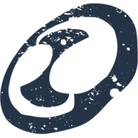
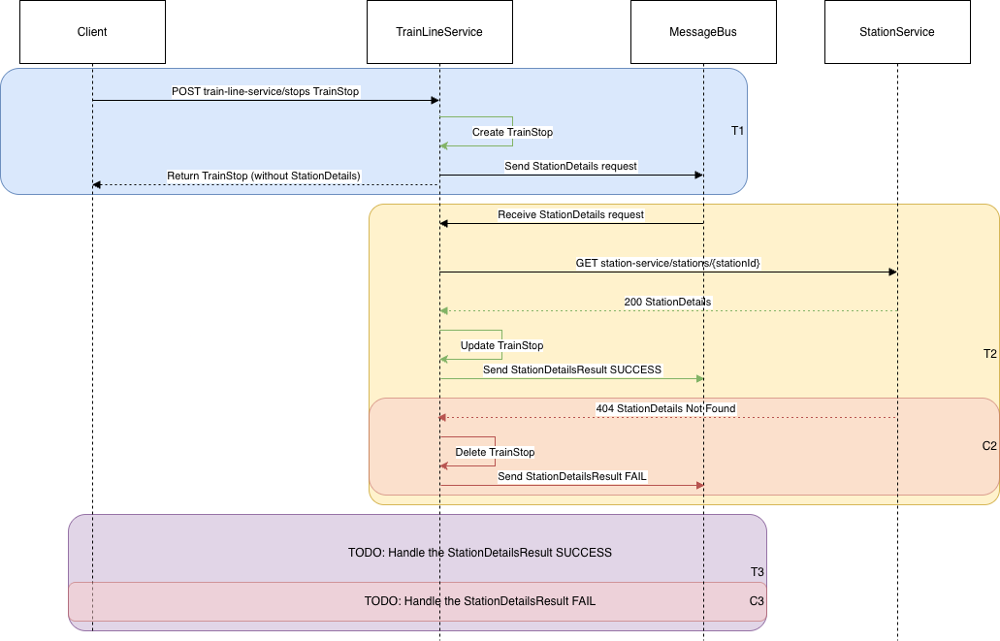
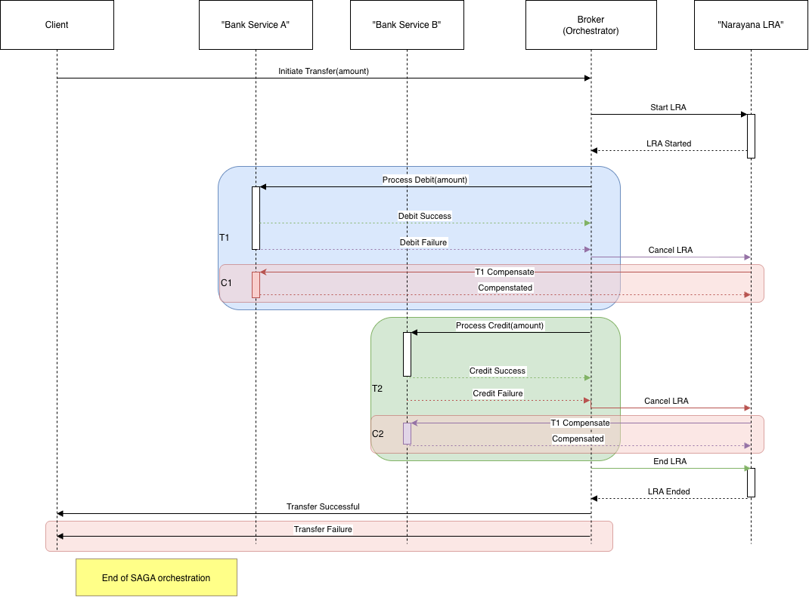
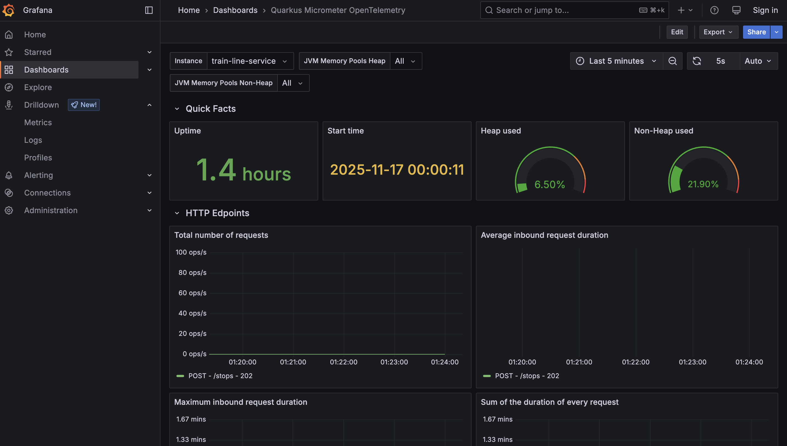
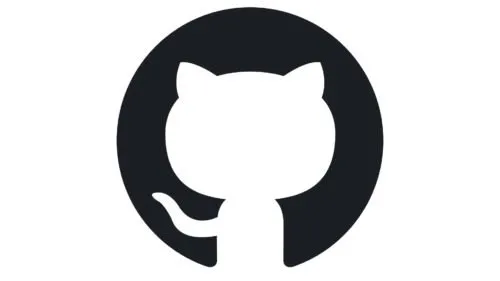

<!-- _class: lead -->
# Quarkus Microservices
## Day 4
- Reactive Programming / Virtual Threads
- SAGA and Messaging
- Observability
- Production Operations

---

<!-- _class: lead -->
# Morning Session 1 (09:00 - 09:45)
## Topic: Reactive vs. Virtual Threads

---

# 1. Reactive Programming (Mutiny)

- **What is Reactive?** An asynchronous programming paradigm concerned with data streams and the propagation of change.
- **Key Concepts:**
  - **Non-blocking:** Threads are not held waiting for I/O operations.
  - **Event-driven:** The program flow is determined by events.
  - **Back-pressure:** A mechanism for consumers to control the rate of production.
- **Connection:** This is the engine behind SmallRye Reactive Messaging (`@Incoming`/`@Outgoing`).
- **Demo:** Show a simple Mutiny `Uni` or `Multi` to demonstrate the "pipeline" concept.
  - https://quarkus.io/guides/getting-started-reactive

---

# 1. Reactive Programming Fork-Join
```java
public Uni<DashboardData> getDashboard(String userId) {
    // 1. Define the two independent, asynchronous actions
    Uni<User> userUni = userService.getUser(userId);
    Uni<List<Notification>> notificationsUni = notificationService.getNotifications(userId);

    // 2. Combine them
    return Uni.combine().all().unis(userUni, notificationsUni)
        // 3. The 'combine' operation returns a List<Object>
        .asTuple()
        
        // 4. When both are complete, transform the tuple into the final DTO
        .onItem().transform(tuple -> {
            User user = tuple.getItem1();
            List<Notification> notifications = tuple.getItem2();
            return new DashboardData(user, notifications);
        });
}
```

---

# 1. Reactive vs. Completable Futures
```java
public class DashboardService {

    private final UserService userService = new UserService();
    private final NotificationService notificationService = new NotificationService();

    // You need a thread pool to run tasks in parallel.
    // Use a try-with-resources block or manage its lifecycle carefully.
    public DashboardData getDashboard(String userId) 
        throws ExecutionException, InterruptedException {

        // Use a fixed thread pool for parallel execution
        try (ExecutorService executor = Executors.newFixedThreadPool(2)) {

            // 1. Fork: Submit the first task to the thread pool
            CompletableFuture<User> userFuture = CompletableFuture.supplyAsync(() -> 
                userService.getUser(userId), executor
            );

            // 2. Fork: Submit the second task to the thread pool (runs in parallel)
            CompletableFuture<List<Notification>> notificationsFuture = CompletableFuture.supplyAsync(() ->
                notificationService.getNotifications(userId), executor
            );

            // 3. Join & Combine: 
            //    thenCombine waits for *both* futures to complete, 
            //    then provides their results to the combining function.
            CompletableFuture<DashboardData> combinedFuture = userFuture.thenCombine(
                notificationsFuture,
                (user, notifications) -> new DashboardData(user, notifications)
            );

            // 4. Get Result (Blocking):
            //    This is the main difference from Mutiny. 
            //    We must now block the current thread to wait for the result.
            return combinedFuture.get(); 
        }
    }
}
```

---

# 2. Virtual Threads (Project Loom)

- **What are Virtual Threads?** Lightweight threads managed by the JVM, not the OS.
- **Key Concepts:**
  - Drastically increases the number of concurrent operations a server can handle.
  - Allows developers to write simple, sequential, blocking-style code that scales massively.
- **Connection:** The "new" way to achieve high concurrency without the complexity of reactive programming.
- **Demo:** Quotes Processor using @RunOnVirtualThread

---

<!-- _class: lead -->
# Morning Session 2 (09:45 - 10:45)
## Topic: SAGA and Messaging In Practice

---

# The SAGA Pattern (Introduction)

- **What is a SAGA?** A sequence of local transactions where each transaction updates data within a single service.
- **Purpose:** To manage data consistency across microservices without using distributed transactions.
- **Long-Lived Processes:** Ideal for workflows that span multiple services and may take a long time to complete.
- **Failure Handling:** If a local transaction fails, the SAGA executes compensating transactions to undo the preceding transactions.

---

# Lab 7, Part 1: The SAGA Trigger
### The API Endpoint

- **Objective:** Create the initial API endpoint that starts the SAGA.
- **Action:** The endpoint receives a request and produces the first event/message.
- **Benefit:** Decouples the synchronous API call from the asynchronous business process.

---

<!-- _class: lead -->
# Morning Break (11:00 - 11:15)

---

<!-- _class: lead -->
# Morning Session 2.2 (09:45 - 12:00)
## Topic: Lab 7 - The Resilient SAGA (Hands-on)

---

# Lab 7, Part 2: The SAGA Step & Resilience
### The Consumer

- **Objective:** Implement a message consumer for a step in the SAGA.
- **Action:** The consumer processes the message, executes a local transaction, and applies resilience patterns.
- **Resilience:** Use `@Retry` to handle transient failures during message processing.

---

# Lab 7, Part 3: The Choreography
### Completing the SAGA

- **Objective:** Connect the SAGA steps by having consumers produce subsequent events.
- **Action:** Upon successful processing, the consumer sends a new message to trigger the next step in the workflow.
- **Choreography:** Services communicate directly with each other via events without a central controller.

---

<!-- _class: lead -->
# Lunch Break (12:00 - 13:00)

---

<!-- _class: lead -->
# Afternoon Session 1 (13:00 - 14:00)
## Topic: SAGA and Messaging Discussion

---

# SAGA: Choreography vs. Orchestration

- **Choreography (Our Approach):**
  - No central coordinator.
  - Each service produces/listens to events and decides what to do.
  - **Pros:** Simple, loosely coupled.
  - **Cons:** Hard to track the process, risk of cyclic dependencies.
- **Orchestration:**
  - A central "SAGA orchestrator" tells services what to do.
  - The orchestrator manages the state of the entire transaction.
  - **Pros:** Centralized logic, easier to monitor.
  - **Cons:** Tighter coupling, orchestrator can become a bottleneck.

---

# SAGA in Quarkus: Narayana LRA

- [MicroProfile LRA Spec](https://github.com/eclipse/microprofile-lra/blob/master/spec/src/main/asciidoc/microprofile-lra-spec.asciidoc)
- [Narayana LRA Participant Support](https://quarkus.io/guides/lra)

 

---

# SAGA: Choreography



---

# SAGA: Orchestration



---

# Compensating Transactions & DLQs

- **Compensating Transactions:**
  - The "undo" operation for a SAGA step.
  - If step `T_i` fails, a compensating transaction `C_i-1` is run to reverse the effects of `T_i-1`.
  - Essential for maintaining data consistency when things go wrong.

- **Dead-Letter Queues (DLQ):**
  - A dedicated queue for messages that could not be processed successfully (after retries).
  - Prevents "poison pills" from blocking the main queue.
  - Allows for manual inspection and reprocessing of failed messages.

---

# Key Messaging Concepts

- **Idempotency:** Can a message be processed multiple times with the same result? Consumers *must* be idempotent.
- **"At-Least-Once" Delivery:** Most message brokers guarantee this. Your system must be designed to handle duplicates.
- **Message Ordering:** Is the order of messages guaranteed? Often, it's only guaranteed within a partition.
- **Poison Pills:** A malformed or problematic message that repeatedly causes a consumer to fail.

---

# SmallRye Reactive Messaging

- **Quarkus's Solution:** Implements the MicroProfile Reactive Messaging specification.
- **`@Incoming` / `@Outgoing`:** Annotations to define consumers and producers.
- **Channels:** Logical names for message streams, configured in `application.properties`.
- **Connectors:** The "glue" that connects a channel to a specific broker (Kafka, AMQP, etc.).

---

<!-- _class: lead -->
# Afternoon Session 2 (14:00 - 15:00)
## Topic: Observing Your Microservices

---

# Why Observability?

In a complex microservices architecture, you need to answer:
- **Is the service running?** (Health Checks)
- **How is the service performing?** (Metrics)
- **What happened during a specific request?** (Distributed Tracing - covered later)

Observability is key to debugging, monitoring, and maintaining a healthy system.

---

# MicroProfile Health

Exposes health check procedures to let orchestrators (like Kubernetes) know if your application is healthy.

- **Three types of checks**:
  - **Liveness (`/q/health/live`)**: Is the application running? If this fails, the container should be restarted.
  - **Readiness (`/q/health/ready`)**: Is the application ready to accept requests? If this fails, the container should be temporarily removed from the load balancer.
  - **Startup Check (`/q/health/started`):** Is the app component started ? Allows for a DOWN status while starting up.
- **Guide**: [MicroProfile Health](https://quarkus.io/guides/microprofile-health)

---

# Implementing Health Checks

Create a bean that implements `HealthCheck` and is annotated with `@Liveness` or `@Readiness`.

```java
@Liveness
@ApplicationScoped
public class DatabaseConnectionHealthCheck implements HealthCheck {

    @Override
    public HealthCheckResponse call() {
        if (isDatabaseConnectionOk()) {
            return HealthCheckResponse.up("Database connection is OK");
        } else {
            return HealthCheckResponse.down("Database connection is down");
        }
    }
}
```

---

# Lab 8: Observability (Readiness)

- **Objective:** Implement readiness checks so Kubernetes knows if the service is ready to consume messages.
- **Verify Connections:**
  - Connection to the PostgreSQL Database.
  - Connection to the Message Broker.
- **Demo:** Show the service reporting "DOWN" when the broker is inaccessible and "UP" when it's available.

---

<!-- _class: lead -->
# Afternoon Break (15:00 - 15:15)

---

<!-- _class: lead -->
# Afternoon Session 3 (15:15 - 16:15)
## Topic: Observability & Production Operations

---

# 1. Metrics with Micrometer
### (Prometheus & Grafana)

- **Topic:** Instrumenting the application for performance monitoring.
- **Micrometer:** The de facto standard for metrics in the Java ecosystem.
- **Steps:**
  1. Add `quarkus-smallrye-metrics`.
  2. Add a `@Counted` metric to the SAGA consumer.
  3. Show the new custom metric in the `/q/metrics` output.
  4. Add `quarkus-micrometer-registry-prometheus` to export in a Prometheus format

---

# Custom Metrics with `@Counted`

Easily count how many times a method is invoked. This is a great way to track how often a downstream service is failing.

```java
@ApplicationScoped
public class StationServiceFallbackHandler {

    @Counted(name = "station_service_fallbacks_total", description = "Counts total fallbacks for the Station Service.")
    public Station getStationByIdFallback(String id) {
        Log.warnf("Fallback for getStationById, station %s not found.", id);
        return new Station("0", "Station Details Currently Unavailable");
    }
}
```
- This metric will be exposed in Prometheus format.

---

# Conceptual Grafana Dashboard

Visualize your metrics to gain insights into application performance.



---

# 2. Centralized & Structured Logging

- **Topic:** Preparing logs for production analysis (e.g., Splunk, Loki).
- **Structured Logging:** Writing logs in a machine-readable format like JSON.
- **Demo Steps:**
  1. Enable JSON logging in `application.properties`.
  2. Add contextual data (`MDC.put(...)`) to the SAGA consumer.
  3. Show the resulting JSON log enriched with the contextual ID.

---

# 3. Distributed Tracing (OpenTelemetry)

- **Topic:** Tracing a single request across all services and message brokers.
- **OpenTelemetry:** A standard for generating and collecting telemetry data (traces, metrics, logs).
- **The "Aha!" Moment:**
  - Add `quarkus-opentelemetry`.
  - Trigger the SAGA and show that the **same `traceId`** is automatically propagated from the initial API call, across Azure Service Bus, and appears in the consumer's log.
- **Discussion:** How this enables end-to-end tracing in tools like Jaeger or Datadog.

---

<!-- _class: lead -->
# Open Discussion & Feedback (16:15 - 16:30)

- Course Feedback & Questionnaire
- Open Discussion
- Resources

---

<!-- _class: lead -->
# End of Training
### Thank You!

-  **Scott Messner**
-  <scott.m.messner@gmail.com>
-  [github.com/blackstrype/quarkus-microservices-training](https://github.com/blackstrype/quarkus-microservices-training)
-  [linkedin.com/in/scott-messner-0264231a](https://www.linkedin.com/in/scott-messner-0264231a/)
